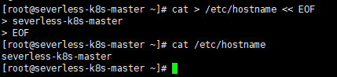
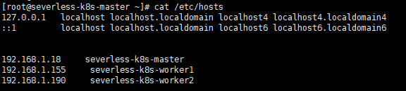
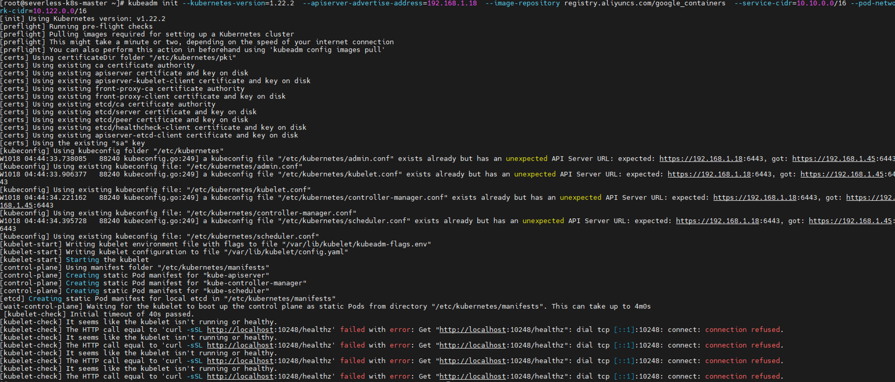
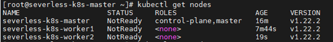
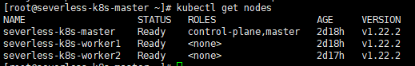

# Kubernetes v1.22.2 环境搭建

[TOC]

## 1、环境准备		

| VM            | 标签名      | 系统       | Docker  | golang   | 配置  |
| ------------- | ----------- | ---------- | ------- | -------- | ----- |
| 192.168.1.18  | k8s-master  | Centos-8.3 | 20.10.9 | go1.17.2 | 2C+2G |
| 192.168.1.155 | k8s-worker1 | Centos-8.3 | 20.10.9 | go1.17.2 | 2C+2G |
| 192.168.1.190 | k8s-worker2 | Centos-8.3 | 20.10.9 | go1.17.2 | 2C+2G |


## 2、三台主机准备工作

### 2.1、修改/etc/hostname文件，更改三台主机名称

​         192.168.1.18主机添加k8s-master

​         192.168.1.155主机添加k8s-worker1

​         192.168.1.190主机添加k8s-worker2

​                                                                    

​		在这里因为本人为了区别其他k8s集群，用serverless标签加以区分了

### 2.2、更改/etc/hosts文件添加主机名与IP映射关系

​		在命令行中执行

​		`

```
cat >> /etc/hosts << EOF
192.168.1.18     severless-k8s-master
192.168.1.155     severless-k8s-worker1
192.168.1.190     severless-k8s-worker2
EOF
```

`



### 2.3、永久关闭防火墙和selinux

​      命令行中以此执行如下命令

```
systemctl stop firewalld

systemctl disable firewalld

sed -i 's/enforcing/disabled/' /etc/selinux/config

setenforce 0

getenforce
```

### 2.4、关闭swap分区

```
swapoff -a   //临时关闭

vim /etc/fstab    //永久关闭（注释掉最后一条配置）
...
#/dev/mapper/centos-swap swap                    swap    defaults        0 0

free -h | grep Swap   //验证Swap关闭情况（显示0代表成功关闭）
Swap:            0B          0B          0B
```

### 2.5、将桥接的IPv4流量传递到iptables的链

```
cat > /etc/sysctl.d/k8s.conf <<EOF
net.bridge.bridge-nf-call-ip6tables = 1
net.bridge.bridge-nf-call-iptables = 1
net.ipv4.ip_forward = 1
vm.swappiness = 0
EOF


sysctl --system
```

### 2.6、Docker安装

```
yum makecache      //更新yum软件包索引

yum  install docker-ce  //安装docker
```

### 2.7、安装kubeadm等工具

#### 2.7.1、添加阿里云K8s的yum源

​		命令行中执行如下命令

```
cat >> /etc/yum.repos.d/kubernetes.repo << EOF
[kubernetes]
name=Kubernetes Repo
baseurl=https://mirrors.aliyun.com/kubernetes/yum/repos/kubernetes-el7-x86_64/
gpgcheck=1
gpgkey=https://mirrors.aliyun.com/kubernetes/yum/doc/rpm-package-key.gpg
enabled=1
EOF
```


#### 2.7.2、安装Kubeadm、Kubelet、Kubectl组件

```
yum  list  |grep kubeadm
```


```
yum -y install kubelet-1.22.2-0 kubeadm-1.22.2-0 kubectl-1.22.2-0  //指定版本号部署

systemctl start docker && systemctl enable docker //配置开机自启动

systemctl enable kubelet
```

### 3、初始化Kubernetes Master（仅在master上执行）

```
kubeadm init --kubernetes-version=1.22.2  \
--apiserver-advertise-address=192.168.1.18  \
--image-repository registry.aliyuncs.com/google_containers  \
--service-cidr=10.10.0.0/16 --pod-network-cidr=10.122.0.0/16


---------------------------------------------------------------------
[init] Using Kubernetes version: v1.22.2
[preflight] Running pre-flight checks
[preflight] Pulling images required for setting up a Kubernetes cluster
[preflight] This might take a minute or two, depending on the speed of your internet connection
[preflight] You can also perform this action in beforehand using 'kubeadm config images pull'
[certs] Using certificateDir folder "/etc/kubernetes/pki"
...
...
[bootstrap-token] configured RBAC rules to allow the csrapprover controller automatically approve CSRs from a Node Bootstrap Token
[bootstrap-token] configured RBAC rules to allow certificate rotation for all node client certificates in the cluster
[bootstrap-token] Creating the "cluster-info" ConfigMap in the "kube-public" namespace
[kubelet-finalize] Updating "/etc/kubernetes/kubelet.conf" to point to a rotatable kubelet client certificate and key
[addons] Applied essential addon: CoreDNS
[addons] Applied essential addon: kube-proxy

Your Kubernetes control-plane has initialized successfully!  //初始化成功

To start using your cluster, you need to run the following as a regular user:

  mkdir -p $HOME/.kube
  sudo cp -i /etc/kubernetes/admin.conf $HOME/.kube/config
  sudo chown $(id -u):$(id -g) $HOME/.kube/config

Alternatively, if you are the root user, you can run:

  export KUBECONFIG=/etc/kubernetes/admin.conf

You should now deploy a pod network to the cluster.
Run "kubectl apply -f [podnetwork].yaml" with one of the options listed at:
  https://kubernetes.io/docs/concepts/cluster-administration/addons/

Then you can join any number of worker nodes by running the following on each as root:

kubeadm join 192.168.1.18:6443 --token 5efda328.x6vl5efda328p9lqp6sj \
        --discovery-token-ca-cert-hash sha256:707160ba4e495d402f11290cfef753ad149068fff74e50e411     

```

出现上面successfully`信息之后，表示初始化已经完成

上面`kubeadm join`完整命令，因为后续node节点加入集群是需要用到，其中包含token

### 4、其他主机上执行加入集群的命令

```
kubeadm join 192.168.1.18:6443 --token 5efda328.x6vl5efda328p9lqp6sj \
        --discovery-token-ca-cert-hash sha256:707160ba4e495d402f11290cfef753ad149068fff74e50e411 
```


## 5、有可能出现的错误记录

### 5.1、初始化时出现 error: Get "http://localhost:10248/healthz"



​       在/etc/docker/daemon.json 中加入如下字段

```
"exec-opts": ["native.cgroupdriver=systemd"],
```

### 5.2、在安装部署的时候，出现问题解决后，需要执行一次kubeadm reset -f来清除一下kebeadm的信息，否则会出现端口，yaml等资源存在的情况


### 5.3、Master节点上查看集群状态



​      安装完Flannel网络插件后才会变成Ready状态

​      

```
apiVersion: policy/v1beta1
kind: PodSecurityPolicy
metadata:
  name: psp.flannel.unprivileged
  annotations:
    seccomp.security.alpha.kubernetes.io/allowedProfileNames: docker/default
    seccomp.security.alpha.kubernetes.io/defaultProfileName: docker/default
    apparmor.security.beta.kubernetes.io/allowedProfileNames: runtime/default
    apparmor.security.beta.kubernetes.io/defaultProfileName: runtime/default
spec:
  privileged: false
  volumes:
  - configMap
  - secret
  - emptyDir
  - hostPath
  allowedHostPaths:
  - pathPrefix: "/etc/cni/net.d"
  - pathPrefix: "/etc/kube-flannel"
  - pathPrefix: "/run/flannel"
  readOnlyRootFilesystem: false
  # Users and groups
  runAsUser:
    rule: RunAsAny
  supplementalGroups:
    rule: RunAsAny
  fsGroup:
    rule: RunAsAny
  # Privilege Escalation
  allowPrivilegeEscalation: false
  defaultAllowPrivilegeEscalation: false
  # Capabilities
  allowedCapabilities: ['NET_ADMIN', 'NET_RAW']
  defaultAddCapabilities: []
  requiredDropCapabilities: []
  # Host namespaces
  hostPID: false
  hostIPC: false
  hostNetwork: true
  hostPorts:
  - min: 0
    max: 65535
  # SELinux
  seLinux:
    # SELinux is unused in CaaSP
    rule: 'RunAsAny'
---
kind: ClusterRole
apiVersion: rbac.authorization.k8s.io/v1
metadata:
  name: flannel
rules:
- apiGroups: ['extensions']
  resources: ['podsecuritypolicies']
  verbs: ['use']
  resourceNames: ['psp.flannel.unprivileged']
- apiGroups:
  - ""
  resources:
  - pods
  verbs:
  - get
- apiGroups:
  - ""
  resources:
  - nodes
  verbs:
  - list
  - watch
- apiGroups:
  - ""
  resources:
  - nodes/status
  verbs:
  - patch
---
kind: ClusterRoleBinding
apiVersion: rbac.authorization.k8s.io/v1
metadata:
  name: flannel
roleRef:
  apiGroup: rbac.authorization.k8s.io
  kind: ClusterRole
  name: flannel
subjects:
- kind: ServiceAccount
  name: flannel
  namespace: kube-system
---
apiVersion: v1
kind: ServiceAccount
metadata:
  name: flannel
  namespace: kube-system
---
kind: ConfigMap
apiVersion: v1
metadata:
  name: kube-flannel-cfg
  namespace: kube-system
  labels:
    tier: node
    app: flannel
data:
  cni-conf.json: |
    {
      "name": "cbr0",
      "cniVersion": "0.3.1",
      "plugins": [
        {
          "type": "flannel",
          "delegate": {
            "hairpinMode": true,
            "isDefaultGateway": true
          }
        },
        {
          "type": "portmap",
          "capabilities": {
            "portMappings": true
          }
        }
      ]
    }
  net-conf.json: |
    {
      "Network": "10.244.0.0/16",
      "Backend": {
        "Type": "vxlan"
      }
    }
---
apiVersion: apps/v1
kind: DaemonSet
metadata:
  name: kube-flannel-ds
  namespace: kube-system
  labels:
    tier: node
    app: flannel
spec:
  selector:
    matchLabels:
      app: flannel
  template:
    metadata:
      labels:
        tier: node
        app: flannel
    spec:
      affinity:
        nodeAffinity:
          requiredDuringSchedulingIgnoredDuringExecution:
            nodeSelectorTerms:
            - matchExpressions:
              - key: kubernetes.io/os
                operator: In
                values:
                - linux
      hostNetwork: true
      priorityClassName: system-node-critical
      tolerations:
      - operator: Exists
        effect: NoSchedule
      serviceAccountName: flannel
      initContainers:
      - name: install-cni
        image: quay.io/coreos/flannel:v0.14.0
        command:
        - cp
        args:
        - -f
        - /etc/kube-flannel/cni-conf.json
        - /etc/cni/net.d/10-flannel.conflist
        volumeMounts:
        - name: cni
          mountPath: /etc/cni/net.d
        - name: flannel-cfg
          mountPath: /etc/kube-flannel/
      containers:
      - name: kube-flannel
        image: quay.io/coreos/flannel:v0.14.0
        command:
        - /opt/bin/flanneld
        args:
        - --ip-masq
        - --kube-subnet-mgr
        resources:
          requests:
            cpu: "100m"
            memory: "50Mi"
          limits:
            cpu: "100m"
            memory: "50Mi"
        securityContext:
          privileged: false
          capabilities:
            add: ["NET_ADMIN", "NET_RAW"]
        env:
        - name: POD_NAME
          valueFrom:
            fieldRef:
              fieldPath: metadata.name
        - name: POD_NAMESPACE
          valueFrom:
            fieldRef:
              fieldPath: metadata.namespace
        volumeMounts:
        - name: run
          mountPath: /run/flannel
        - name: flannel-cfg
          mountPath: /etc/kube-flannel/
      volumes:
      - name: run
        hostPath:
          path: /run/flannel
      - name: cni
        hostPath:
          path: /etc/cni/net.d
      - name: flannel-cfg
        configMap:
          name: kube-flannel-cfg
          
         
```


将上面文件复制成yaml文件 kube-flannel.yaml

执行 kubectl apply -f kube-flannel.yaml



