## Kubebuilder使用简介

**Kubebuilder** **是基于** **Custom Resource Definition (CRD) **构建 **Kubernetes API** **的框架**

由 Kubernetes Special Interest Group (SIG) API Machinery 所有及维护

主要是：

- 提供脚手架工具初始化 CRDs 工程，自动生成 boilerplate 代码和配置；
- 提供代码库封装底层的 K8s go-client；

官方文档 https://book.kubebuilder.io/introduction.html


* Outline
{:toc}


## 认识CR/CRD/Operator

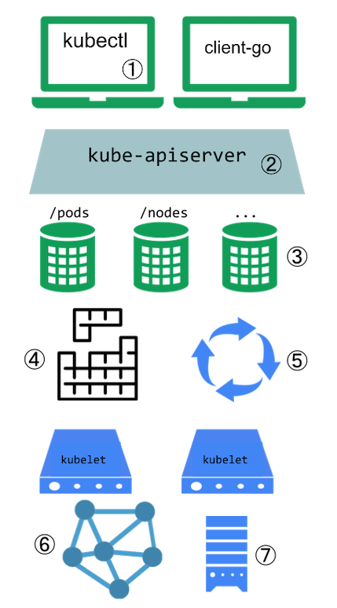

​	

​		**Kubernetes 系统扩展点**：

​				① kubectl 插件

​				② 自定义的 API 访问扩展

​				③ **Custom Resource (CR)**：自定义资源, Kubernetes API 的扩展

​				④ 调度器扩展

​				⑤ **Custom Controller**: 自定义控制器，与 CR 共同使用实现声明式 API

​				⑥ 网络插件

​				⑦ 存储插件                                           

### CRD & Operator

​		**CustomResourceDefinition** **(CRD)** 

​				定义 CRD 会使用用户所设定的名字和模式定义 (Schema) 创建一个新 CR 

​				Kubernetes API 负责为定制资源提供存储和访问服务

​		**Operator = Custom Resource + Custom Controller** 

 		Operator 名词来源于操作员，在 Kubernetes 中自动化完成一系列工作。例如：
 	
 		 1、按需部署应用
 	
 		 2、获取/还原应用状态的备份
 	
 		 3、更多 Operator 示例可参考 https://operatorhub.io/

## 核心概念

### GVKs&GVRs		

​	GVK=GroupVersionKind，GVR=GroupVersionResource

### API Group & Versions (GV)

​	API Group是相关API功能的集合，每个Group拥有一或多个Versions，用于接口演进。

### kinds & Resources

​	每个GV都包含多个API类型，成为kinds，在不同的Versions之间同一个kind定义可能不同，Resource是kind的对象标识（

[resource-types]: https://kubernetes.io/docs/reference/kubectl/overview/#resource-types

）

​	一般来说kinds和resources是1:1的，比如pods resource对应pod kind，但是有时候相同的kind可能对应多个resources，比如scale kind可能会对应很多resource：deployment/scale，replicasets/scale，对于CRD来说，只会是1:1的关系。

​	每一个GVK都关联着一个package中给定的root Go type，比如apps/v1/Deployment就关联着k8s源码里面k8s.io/api/apps/v1 package 中的 Deployment struct，我们提交的各种资源定义YAML文件都需要写：

- apiVersion：这个就是 GV 。
- kind：这个就是 K。

根据GVK k8s就能找到你到底要创建什么类型的资源，根据你定义的spec创建好资源之后就成为了resource，也就是GVR。GVK/GVR就是k8s资源的坐标，是我们创建/删除/修改/读取资源的基础。

​			•通过 [https://pkg.go.dev/k8s.io/api ](https://pkg.go.dev/k8s.io/api)可以搜索到资源详细信息（方法、字段等）

​		    •常用资源 GVK：

​				•core/v1/Pod

​				•core/v1/Node

​				•core/v1/Service

​				•apps/v1/Deployment

​				•apps/v1/StatefulSet

​				•batch/v1/Job

​				•batch/v1beta1/Cronjob

### Scheme

每一组Controllers都需要一个Scheme，提供了kinds与Go types的映射，也就是说给定Go type就知道他的GVK，给定GVK就知道他的Go type，比如说我们给定一个Scheme: "tutotial.kubebuilder.io/api/v1".CronJob{}这个Go type映射到batch.tutotial.kubebuilder.io/v1 的 CronJob GVK，那么从 Api Server 获取到下面的 JSON:

```
{
    "kind": "CronJob",
    "apiVersion": "batch.tutorial.kubebuilder.io/v1",
    ...
}
```

就能构造出对应的Go type了，通过这个Go type也能正确地获取GVR一些信息，控制器可以通过Go type获取到期望状态以及其他辅助信息进行调谐逻辑。

### Manager

kuberbuilder的核心组件，具有3个职责：

- 负责运行所有的 Controllers；
- 初始化共享 caches，包含 listAndWatch 功能；
- 初始化 clients 用于与 Api Server 通信。

### Cache

kubebuilder的核心组件，负责在controller进程里面根据Scheme同步Api Server中所有该Controller关心GVKs的GVRs，其核心是GVK—>Informer的映射，Informer会负责监听对应GVK的GVRs的创建/删除/更新/操作，以触发Controller的Reconcile逻辑。

### Controller

kubebuilder为我们生成的脚手架文件，我们只需要实现Reconcile方法即可。

### Clients

在实现Controller的时候不可避免地需要针对某些资源类型进行创建/删除/更新，就是通过该Clients实现的，其中查询功能实际查询是本地的Cache，写操作直接访问Api Server。

### Index

由于Controller经常要对Cache进行查询，kubebuilder提供Index utility给Cache加索引提升查询效率。

### Finalizer

在一般情况下，如果资源被删除之后，我们虽然能够被触发删除事件，但是这个时候从Cache里面无法读取任何被删除对象的信息，这样一来，导致很多垃圾清理工作因为信息不足无法进行，k8s 的Finalizer字段用于处理这种情况。在k8s中，只要对象ObjectMeta里面的Finalizers不为空，对该对象的delete操作就会转变为update操作，具体说就是update deletionTimestamp字段，其意义就是告诉k8s的GC “在deletionTimestamp 这个时刻之后，只要 Finalizers 为空，就立马删除掉该对象”。

所以一般的使用姿势就是在创建对象时把 Finalizers 设置好（任意 string），然后处理 DeletionTimestamp 不为空的 update 操作（实际是 delete），根据 Finalizers 的值执行完所有的 pre-delete hook（此时可以在 Cache 里面读取到被删除对象的任何信息）之后将 Finalizers 置为空即可。

### OwnerReference

K8s GC 在删除一个对象时，任何 ownerReference 是该对象的对象都会被清除，与此同时，Kubebuidler 支持所有对象的变更都会触发 Owner 对象 controller 的 Reconcile 方法。


## Kuberbuilder 架构（待补充）

> 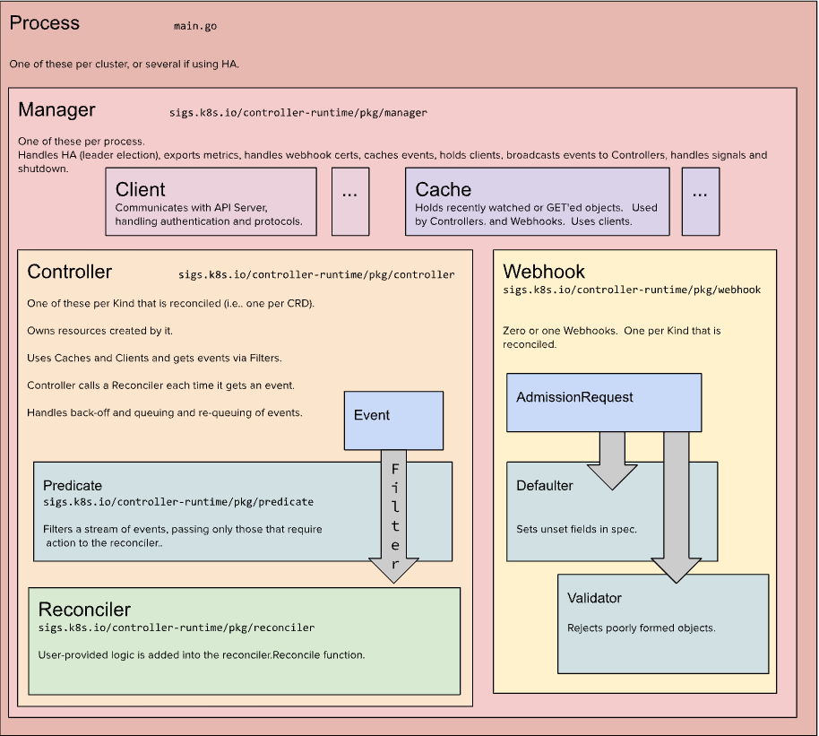


## kubebuilder使用

### kubebuilder使用步骤

​	1.创建脚手架工程

​	2.创建 API

​	3.定义 CRD

​	4.编写 Controller 逻辑

​	5.测试发布

下面以一个具体的例子来说明kubebuilder的使用方式

### kubebuilder实例

#### 需求背景

​		k8s 服务实例流量超过一定数值或减少一定数值，自动伸缩pod。这也是serverless以及k8s的核心功能，这里为了简化工作，仅仅实现deployment的replica数值修改，来达到pod伸缩目的。

#### CRD设计—Spec部分

​		1、image：业务对应的镜像

​		2、port：外部请求访问的端口号

​		3、singlePodQps：单个pod的流量

​		4、totalQps：服务的流量

#### CRD设计—Status部分

​		Status用来保存实际值，这里设计成只有一个字段realQps，表示当前整个operator实际能支持的QPS，这样无论何时，我们可以知道当前系统实际上能支持多少QPS。

#### CRD源码

```
package v1

import (
   "fmt"
   metav1 "k8s.io/apimachinery/pkg/apis/meta/v1"
   "strconv"
)

// EDIT THIS FILE!  THIS IS SCAFFOLDING FOR YOU TO OWN!
// NOTE: json tags are required.  Any new fields you add must have json tags for the fields to be serialized.

// ServerlessWebSpec defines the desired state of ServerlessWeb
type ServerlessWebSpec struct {
   // INSERT ADDITIONAL SPEC FIELDS - desired state of cluster
   // Important: Run "make" to regenerate code after modifying this file

   //业务服务对应的镜像，包括名称：tag版本
   Image string `json:"image"`
   //service占用的宿主机端口，外部请求通过此端口访问pod的服务
   Port *int32 `json:"port"`

   // 单个pod的QPS上限
   SinglePodQps *int32 `json:"singlePodQps"`

   //总QPS
   TotalQps *int32 `json:"totalQps"`

}

// ServerlessWebStatus defines the observed state of ServerlessWeb
type ServerlessWebStatus struct {
   // INSERT ADDITIONAL STATUS FIELD - define observed state of cluster
   // Important: Run "make" to regenerate code after modifying this file

   //该业务实际QPS
   RealQps *int32 `json:"realQps"`
}

//+kubebuilder:object:root=true
//+kubebuilder:subresource:status

// ServerlessWeb is the Schema for the serverlesswebs API
type ServerlessWeb struct {
   metav1.TypeMeta   `json:",inline"`
   metav1.ObjectMeta `json:"metadata,omitempty"`

   Spec   ServerlessWebSpec   `json:"spec,omitempty"`
   Status ServerlessWebStatus `json:"status,omitempty"`
}

func (serverlessWeb *ServerlessWeb) String() string {
   var realQps string

   if nil == serverlessWeb.Status.RealQps{
      realQps="nil"
   }else {
      realQps=strconv.Itoa(int(*(serverlessWeb.Status.RealQps)))
   }

   return fmt.Sprintf("Image [%s], Port [%d], SinglePodQps [%d], TotalQps [%d], RealQps [%s]",
      serverlessWeb.Spec.Image,
      *(serverlessWeb.Spec.Port),
      *(serverlessWeb.Spec.SinglePodQps),
      *(serverlessWeb.Spec.TotalQps),
      realQps)
}

//+kubebuilder:object:root=true

// ServerlessWebList contains a list of ServerlessWeb
type ServerlessWebList struct {
   metav1.TypeMeta `json:",inline"`
   metav1.ListMeta `json:"metadata,omitempty"`
   Items           []ServerlessWeb `json:"items"`
}

func init() {
   SchemeBuilder.Register(&ServerlessWeb{}, &ServerlessWebList{})
}
```

#### 业务逻辑

​		CRD核心数据结构已经确定，下面就是业务逻辑设计，主要是考虑清除controller的Reconcile方法里面可以做些啥，也是我们代码编写的主要地方。流程图如下：

​																			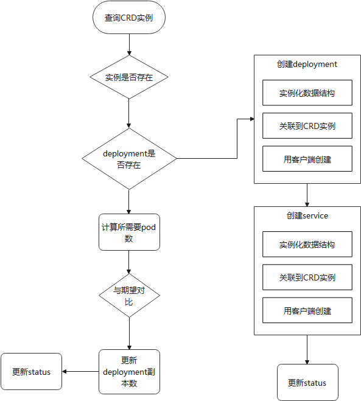		


#### 新建项目serverlessweb

​		1、新建文件名serverlessweb

​			  执行如下命令，创建名为serverless的项目

​                                                                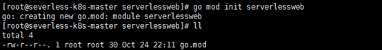

​                                                                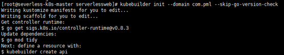

​	          得到的文件如下：

​																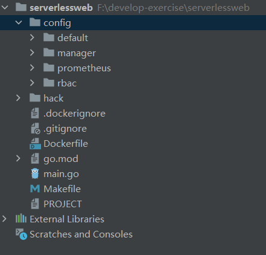


​		2、创建CRD资源，执行如下命令

​                                                                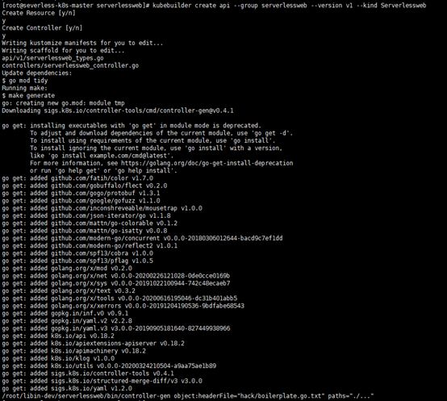

​			得到的文件如下：

​																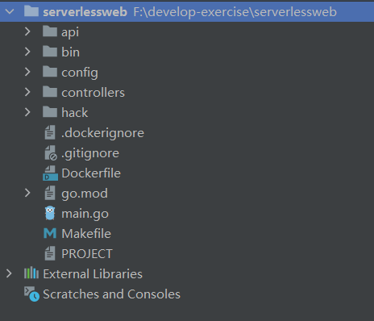

#### CRD编码

##### 		1、修改serverlessweb\api\v1\serverlessweb_types.go

​			   Windows goland开发go可参考：

代码如下：

```
/*
Copyright 2021.

Licensed under the Apache License, Version 2.0 (the "License");
you may not use this file except in compliance with the License.
You may obtain a copy of the License at

    http://www.apache.org/licenses/LICENSE-2.0

Unless required by applicable law or agreed to in writing, software
distributed under the License is distributed on an "AS IS" BASIS,
WITHOUT WARRANTIES OR CONDITIONS OF ANY KIND, either express or implied.
See the License for the specific language governing permissions and
limitations under the License.
*/

package v1

import (
	"fmt"
	metav1 "k8s.io/apimachinery/pkg/apis/meta/v1"
	"strconv"
)

// EDIT THIS FILE!  THIS IS SCAFFOLDING FOR YOU TO OWN!
// NOTE: json tags are required.  Any new fields you add must have json tags for the fields to be serialized.

// ServerlessWebSpec defines the desired state of ServerlessWeb
type ServerlessWebSpec struct {
	// INSERT ADDITIONAL SPEC FIELDS - desired state of cluster
	// Important: Run "make" to regenerate code after modifying this file

	//业务服务对应的镜像，包括名称：tag版本
	Image string `json:"image"`
	//service占用的宿主机端口，外部请求通过此端口访问pod的服务
	Port *int32 `json:"port"`

	// 单个pod的QPS上限
	SinglePodQps *int32 `json:"singlePodQps"`

	//总QPS
	TotalQps *int32 `json:"totalQps"`

}

// ServerlessWebStatus defines the observed state of ServerlessWeb
type ServerlessWebStatus struct {
	// INSERT ADDITIONAL STATUS FIELD - define observed state of cluster
	// Important: Run "make" to regenerate code after modifying this file

	//该业务实际QPS
	RealQps *int32 `json:"realQps"`
}

//+kubebuilder:object:root=true
//+kubebuilder:subresource:status

// ServerlessWeb is the Schema for the serverlesswebs API
type ServerlessWeb struct {
	metav1.TypeMeta   `json:",inline"`
	metav1.ObjectMeta `json:"metadata,omitempty"`

	Spec   ServerlessWebSpec   `json:"spec,omitempty"`
	Status ServerlessWebStatus `json:"status,omitempty"`
}

func (serverlessWeb *ServerlessWeb) String() string {
	var realQps string

	if nil == serverlessWeb.Status.RealQps{
		realQps="nil"
	}else {
		realQps=strconv.Itoa(int(*(serverlessWeb.Status.RealQps)))
	}

	return fmt.Sprintf("Image [%s], Port [%d], SinglePodQps [%d], TotalQps [%d], RealQps [%s]",
		serverlessWeb.Spec.Image,
		*(serverlessWeb.Spec.Port),
		*(serverlessWeb.Spec.SinglePodQps),
		*(serverlessWeb.Spec.TotalQps),
		realQps)
}

//+kubebuilder:object:root=true

// ServerlessWebList contains a list of ServerlessWeb
type ServerlessWebList struct {
	metav1.TypeMeta `json:",inline"`
	metav1.ListMeta `json:"metadata,omitempty"`
	Items           []ServerlessWeb `json:"items"`
}

func init() {
	SchemeBuilder.Register(&ServerlessWeb{}, &ServerlessWebList{})
}

```

##### 		2、执行make install部署CRD到kubernetes

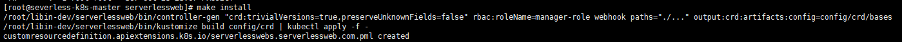

##### 		3、api-versions命令查看GV

​			      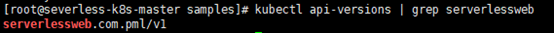


##### 		4、serverlessweb\controllers\serverlessweb_controller.go 修改 Reconcile逻辑

###### 					4.1添加资源权限

​														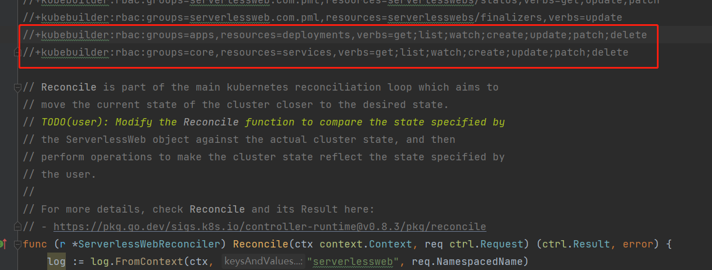	

###### 					4.2根据上面提到的业务进行业务编码：

```
func (r *ServerlessWebReconciler) Reconcile(ctx context.Context, req ctrl.Request) (ctrl.Result, error) {
	log := log.FromContext(ctx, "serverlessweb", req.NamespacedName)

	log.Info("start reconcile logic")

	//实例化数据结构
	instance := &serverlesswebv1.ServerlessWeb{}

	// 通过客户端工具查询
	err := r.Get(ctx, req.NamespacedName, instance)

	if err != nil {
		// 如果没有实例，就返回空结果，不再调用Reconcile
		if errors.IsNotFound(err) {
			log.Info("instance not found, maybe not created or removed")
			return reconcile.Result{}, nil
		}

		log.Error(err, "get instance error")
		return ctrl.Result{}, err
	}

	log.Info("instance :"+ instance.String())

	deployment := &appsv1.Deployment{}

	err = r.Get(ctx, req.NamespacedName, deployment)

	if err != nil {
		if errors.IsNotFound(err) {
			log.Info("deployment not exists")

			if *(instance.Spec.TotalQps) < 1 {
				log.Info("totalQps < 1 not need deployment.")
				return ctrl.Result{}, nil
			}

			//先创建service
			if err = createServiceIfNotExists(ctx, r, instance, req); err != nil {
				log.Error(err, "create service error.")
				return ctrl.Result{}, err
			}

			//创建deployment
			if err = createDeployment(ctx, r, instance); err != nil {
				log.Error(err, "create deployment error")
				return ctrl.Result{}, err
			}

			//创建成功更新状态
			if err = updateStatus(ctx, r, instance); err != nil {
				log.Error(err, "update status error.")
				return ctrl.Result{}, err
			}

			return ctrl.Result{}, nil
		} else {
			log.Error(err, "get deployment error.")
			return ctrl.Result{}, nil
		}
	}

	// 根据单QPS和总QPS计算期望的副本数
	expectReplicas := getExpectReplicas(instance)

	// 当前deployment的期望副本数
	realReplicas := *deployment.Spec.Replicas

	log.Info(fmt.Sprintf("expectReplicas [%d], realReplicas [%d]", expectReplicas, realReplicas))

	// 如果相等，就直接返回了
	if expectReplicas == realReplicas {
		log.Info("10. return now")
		return ctrl.Result{}, nil
	}

	// 如果不等，就要调整
	*(deployment.Spec.Replicas) = expectReplicas

	log.Info("update deployment's Replicas")
	// 通过客户端更新deployment
	if err = r.Update(ctx, deployment); err != nil {
		log.Error(err, "update deployment replicas error")

		return ctrl.Result{}, err
	}

	log.Info("update status")

	// 如果更新deployment的Replicas成功，就更新状态
	if err = updateStatus(ctx, r, instance); err != nil {
		log.Error(err, "update status error")

		return ctrl.Result{}, err
	}

	return ctrl.Result{}, nil
}

//获取期望的副本数
func getExpectReplicas(serverlessweb *serverlesswebv1.ServerlessWeb) int32 {
	//单个pod的Qps
	singlePodQps := *(serverlessweb.Spec.SinglePodQps)

	//期望的总Qps
	totalQps := *(serverlessweb.Spec.TotalQps)

	//Replicas需要创建的副本数
	replicas := totalQps / singlePodQps

	if totalQps%singlePodQps > 0 {
		replicas++
	}

	return replicas
}

//创建service
func createServiceIfNotExists(ctx context.Context, r *ServerlessWebReconciler, serverlessweb *serverlesswebv1.ServerlessWeb, req ctrl.Request) error {

	log := log.FromContext(ctx, "func", "createService")

	service := &corev1.Service{}

	err := r.Get(ctx, req.NamespacedName, service)

	//查询没有结果，service正常，不需要操作
	if err == nil {
		log.Info("service exists.")
		return nil
	}

	//有错误并且不是NotFound，就直接返回
	if !errors.IsNotFound(err) {
		log.Error(err, "query service error.")
		return err
	}

	//实例化一个数据结构
	service = &corev1.Service{
		ObjectMeta: metav1.ObjectMeta{
			Namespace: serverlessweb.Namespace,
			Name:      serverlessweb.Name,
		},
		Spec: corev1.ServiceSpec{
			Ports: []corev1.ServicePort{{
				Name:     "http",
				Port:     8080,
				NodePort: *serverlessweb.Spec.Port,
			},
			},
			Selector: map[string]string{
				"app": APP_NAME,
			},
			Type: corev1.ServiceTypeNodePort,
		},
	}

	//建立关联后，删除serverlessweb资源时就会将service也删除掉
	log.Info("set reference.")
	if err := controllerutil.SetControllerReference(serverlessweb, service, r.Scheme); err != nil {
		log.Error(err, "SetControllerReference error")
		return err
	}

	//创建service
	log.Info("start create service.")
	if err := r.Create(ctx, service); err != nil {
		log.Error(err, "create service error")
		return err
	}
	log.Info("create service success")

	return nil
}

func createDeployment(ctx context.Context, r *ServerlessWebReconciler, serverlessweb *serverlesswebv1.ServerlessWeb) error {
	log := log.FromContext(ctx, "func", "createDeployment")

	//计算期望的pod数量
	expectReplicas := getExpectReplicas(serverlessweb)

	log.Info(fmt.Sprintf("expectReplicas [%d]", expectReplicas))

	//实例化一个数据结构
	deployment := &appsv1.Deployment{
		ObjectMeta: metav1.ObjectMeta{
			Namespace: serverlessweb.Namespace,
			Name:      serverlessweb.Name,
		},
		Spec: appsv1.DeploymentSpec{
			//副本数
			Replicas: pointer.Int32Ptr(expectReplicas),
			Selector: &metav1.LabelSelector{
				MatchLabels: map[string]string{
					"app": APP_NAME,
				},
			},

			Template: corev1.PodTemplateSpec{
				ObjectMeta: metav1.ObjectMeta{
					Labels: map[string]string{
						"app": APP_NAME,
					},
				},
				Spec: corev1.PodSpec{
					Containers: []corev1.Container{
						{
							Name:            APP_NAME,
							Image:           serverlessweb.Spec.Image,
							ImagePullPolicy: "IfNotPresent",
							Ports: []corev1.ContainerPort{
								{
									Name:          "http",
									Protocol:      corev1.ProtocolSCTP,
									ContainerPort: CONTAINER_PORT,
								},
							},
							Resources: corev1.ResourceRequirements{
								Requests: corev1.ResourceList{
									"cpu":    resource.MustParse(CPU_REQUEST),
									"memory": resource.MustParse(MEM_REQUEST),
								},
								Limits: corev1.ResourceList{
									"cpu":    resource.MustParse(CPU_LIMIT),
									"memory": resource.MustParse(MEM_LIMIT),
								},
							},
						},
					},
				},
			},
		},
	}

	//这一步很关键，建立关联后，删除serverlessweb资源时就会将deployment也删除
	log.Info("set reference")
	if err := controllerutil.SetControllerReference(serverlessweb, deployment, r.Scheme); err != nil {
		log.Error(err, "SetControllerReference error")
		return err
	}

	//创建deployment
	log.Info("start create deployment")
	if err := r.Create(ctx, deployment); err != nil {
		log.Error(err, "create deployment error")
		return err
	}
	log.Info("create deployment success.")
	return nil
}

// 更新最新状态
func updateStatus(ctx context.Context, r *ServerlessWebReconciler, serverlessweb *serverlesswebv1.ServerlessWeb) error {
	log := log.FromContext(ctx, "func", "updateStatus")

	//单个pod Qps
	singlePodQps := *(serverlessweb.Spec.SinglePodQps)

	// pod总数
	replicas := getExpectReplicas(serverlessweb)

	if nil == serverlessweb.Status.RealQps {
		serverlessweb.Status.RealQps = new(int32)
	}

	*(serverlessweb.Status.RealQps) = singlePodQps * replicas

	log.Info(fmt.Sprintf("singlePodQps [%d], replicas [%d], realQps[%d]", singlePodQps, replicas, *(serverlessweb.Status.RealQps)))

	if err := r.Update(ctx, serverlessweb); err != nil {
		log.Error(err, "update instance error")
		return err
	}

	return nil
}
```


#### 部署运行

##### 本地运行controller

Makefile文件所在目录，执行命令make run即可编译运行controller

​													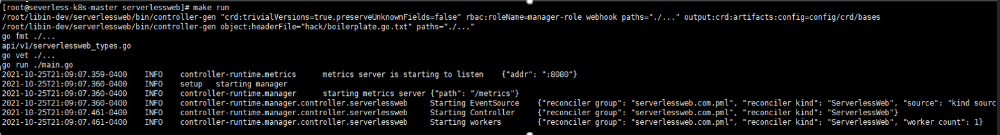


##### 新建serverlessweb资源对象

###### 	1、修改serverlessweb\config\samples\serverlessweb_v1_serverlessweb.yaml

```
apiVersion: serverlessweb.com.pml/v1
kind: ServerlessWeb
metadata:
  namespace: dev
  name: serverlessweb-sample
spec:
  image: tomcat:jre8-openjdk
  port: 30003
  singlePodQps: 50
  totalQps: 100
```

###### 	2、执行命令kubectl apply -f config/samples/serverlessweb_v1_serverlessweb.yaml

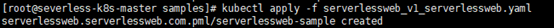


###### 	3、查看controller的窗口日志

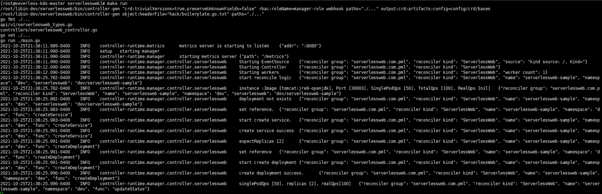

​			查看k8s集群，发现有了我们需要pod

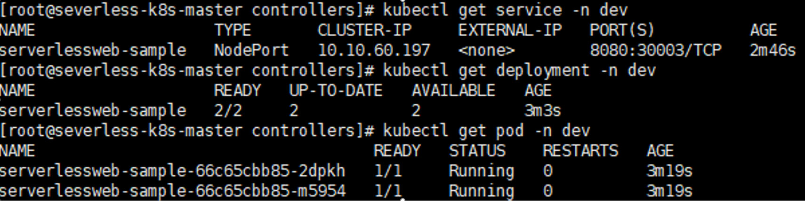


#### 验证业务功能

界面访问Tomcat即可

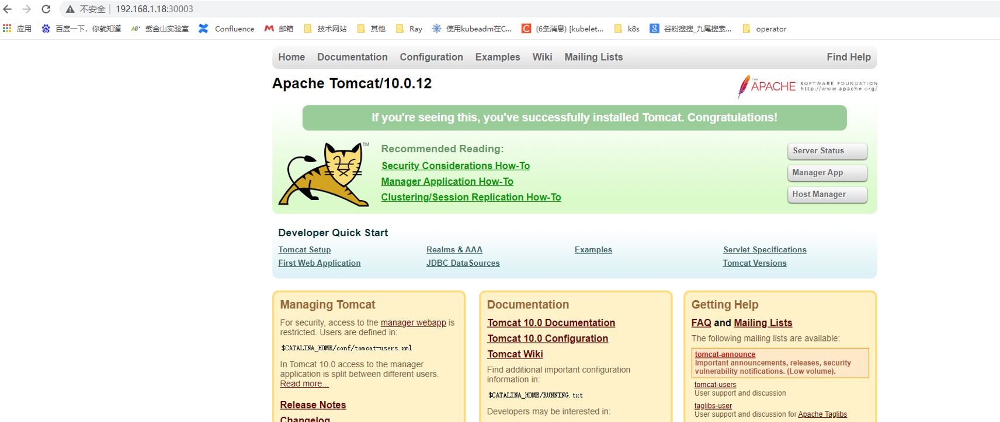


访问不成功，可以进行如下操作

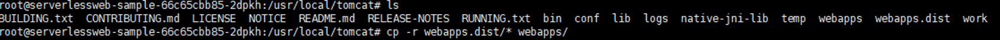


在serverlessweb\config\samples目录下新增伸缩两个yaml文件，用来验证pod的伸缩

serverlessweb_v1_singlePodQps_update.yaml

```
spec:
  singlePodQps: 20
```

serverlessweb_v1_totalPodQps_update.yaml

```
spec:
  totalQps: 10
```


在命令行中执行如下命令

kubectl patch serverlessweb serverlessweb-sample -n dev --type merge --patch "$(cat serverlessweb_v1_singlePodQps_update.yaml)"

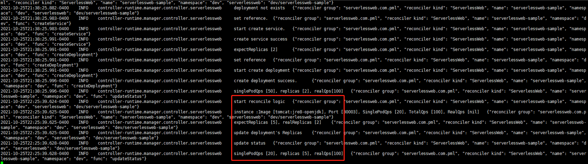

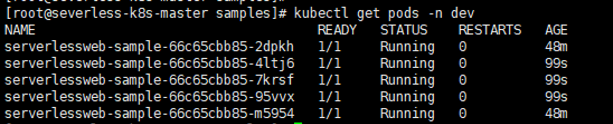

kubectl patch serverlessweb serverlessweb-sample -n dev --type merge --patch "$(cat serverlessweb_v1_totalPodQps_update.yaml)"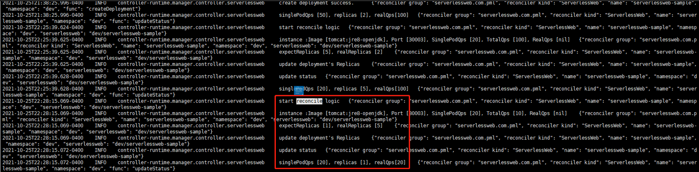

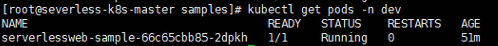																			


//

## CR/CRD关系（待补充）

### CRD是什么？

​    CRD就是一个数据库表。举个例子，我们在数据库中创建一个名为Fruit的表，该表包含了许多记录（record），例如apple、banana和orange。这些记录有很多列（column），如“甜度”、“味道”和“重量”，来显示水果的特性。CRD就像一个Fruit表。

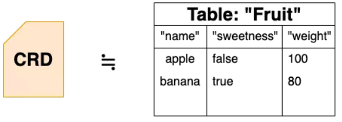

CR（Custom Resource，自定义资源）的每个记录（record）都类似于 apple。

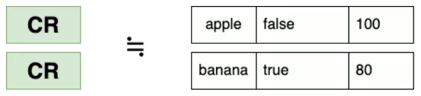

创建 CRD（表）之后，我们可以添加或删除 CR（记录）。

​    为什么需要CRD？因为越来越多的用户熟悉了Kubernetes的用法后，希望更广泛地使用它。他们将更多数据输入Kubernetes来使用，这些数据格式互不相同，而且不是Kubernetes原本就有定义的，因此他们在Kubernetes中创建表的种类，并设置自定义的列名或类型，就像在数据库中那样定义表，这就是CRD的由来。

### 如何创建CRD？

如上所述，CRD是一个表，创建表时，我们需要定义表的格式，例如列名和类型，这些元素在CRD文件中以YAML或JSON格式描述。

CR以YAML或JSON格式描述记录（record）的每个值。

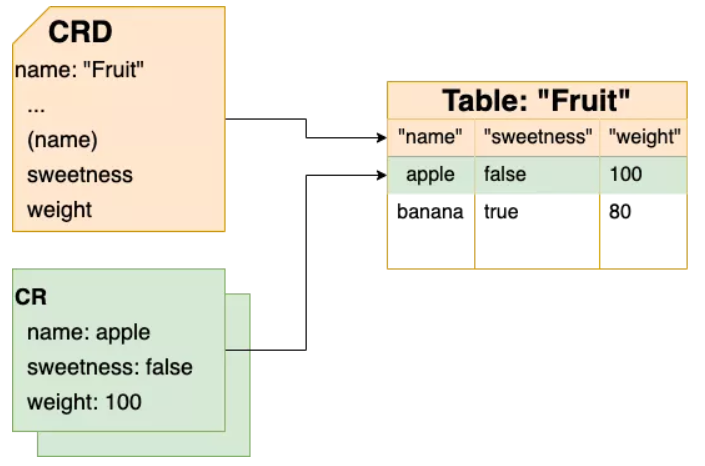


这是CRD内部详细信息。

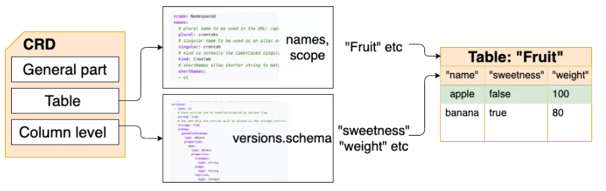

CRD格式分为三个部分

​     1）常规部分（General part）：与其他Kubernetes资源相同。元数据包括CRD的名称本身（name：“fruit-crd”等）。apiVersion和kind也是必需的。

​     2）表级信息（Table level info）：表名（kind：“Fruit”）、命令行的小写名称（simpler:"fruit"）、复数形式（plural：”fruits“）

​     3）列级信息（Column level info）：列名（"sweetness"）、列类型（"boolean"、"string"、"integer"、"object"）、Nested Object(props: <child object name and columns>)。这些格式遵循OpenAPISpecification v3。


更多详细信息可以参阅官方文档：

https://kubernetes.io/docs/tasks/extend-kubernetes/custom-resources/custom-resource-definitions/#create-a-customresourcedefinition


https://mp.weixin.qq.com/s/YNELBbUZ1pUnCanVlVkxOg

https://itnext.io/crd-is-just-a-table-in-kubernetes-13e15367bbe4

https://github.com/onelittlenightmusic/k8sasdb

https://github.com/onelittlenightmusic/k8sasdb/tree/master/test