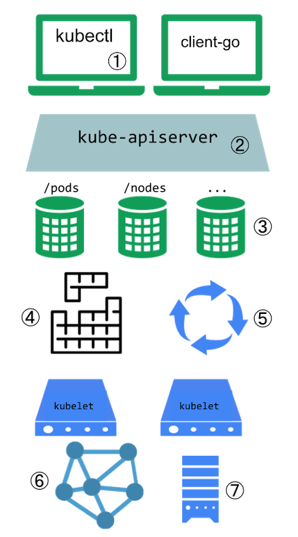
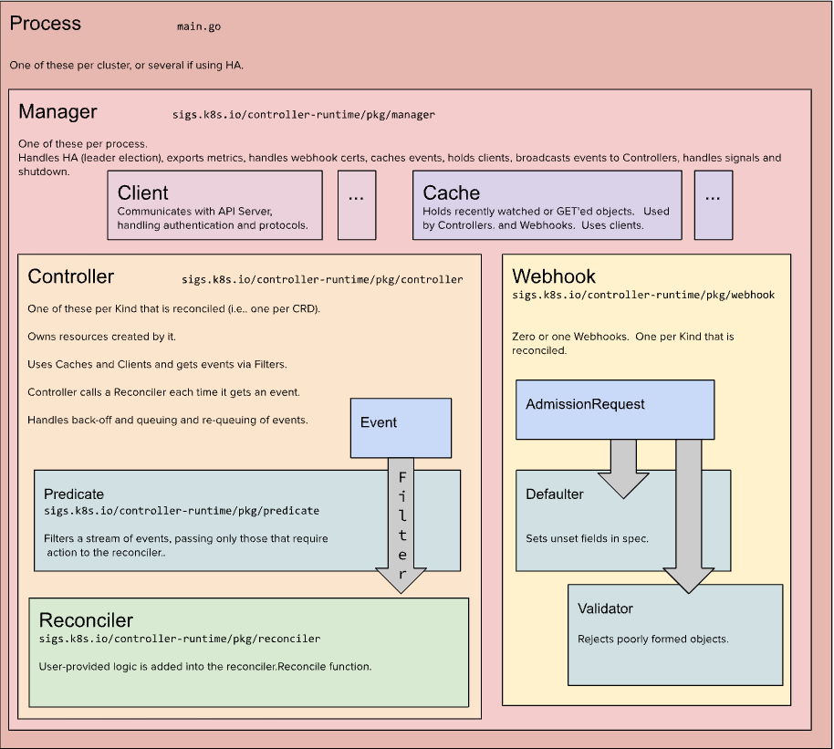

## Kuberbuilder使用简介

**Kubebuilder** **是基于** **Custom Resource Definition (****CRD)** **构建** **Kubernetes API** **的框架**

由 Kubernetes Special Interest Group (SIG) API Machinery 所有及维护

主要是：

- 提供脚手架工具初始化 CRDs 工程，自动生成 boilerplate 代码和配置；
- 提供代码库封装底层的 K8s go-client；

官方文档 https://book.kubebuilder.io/introduction.html

* Outline
{:toc}


## 认识CR/CRD/Operator



​	

​		**Kubernetes 系统扩展点**：

​				① kubectl 插件

​				② 自定义的 API 访问扩展

​				③ **Custom Resource (CR)**：自定义资源, Kubernetes API 的扩展

​				④ 调度器扩展

​				⑤ **Custom Controller**: 自定义控制器，与 CR 共同使用实现声明式 API

​				⑥ 网络插件

​				⑦ 存储插件

​                                                               

### CRD & Operator（待补充）

​		**CustomResourceDefinition** **(CRD)** 

​				定义 CRD 会使用用户所设定的名字和模式定义 (Schema) 创建一个新 CR 

​				Kubernetes API 负责为定制资源提供存储和访问服务

​		**Operator = Custom Resource + Custom Controller** 

 				Operator 名词来源于操作员，在 Kubernetes 中自动化完成一系列工作。例如：
 	
				  ①按需部署应用
 	
 				 ②获取/还原应用状态的备份
 	
 				 ③更多 Operator 示例可参考 https://operatorhub.io/

## 核心概念

### GVKs&GVRs		

​	GVK=GroupVersionKind，GVR=GroupVersionResource

### API Group & Versions (GV)

​	API Group是相关API功能的集合，每个Group拥有一或多个Versions，用于接口演进。

### kinds & Resources

​	每个GV都包含多个API类型，成为kinds，在不同的Versions之间同一个kind定义可能不同，Resource是kind的对象标识（

[resource-types]: https://kubernetes.io/docs/reference/kubectl/overview/#resource-types

）

​	一般来说kinds和resources是1:1的，比如pods resource对应pod kind，但是有时候相同的kind可能对应多个resources，比如scale kind可能会对应很多resource：deployment/scale，replicasets/scale，对于CRD来说，只会是1:1的关系。

​	每一个GVK都关联着一个package中给定的root Go type，比如apps/v1/Deployment就关联着k8s源码里面k8s.io/api/apps/v1 package 中的 Deployment struct，我们提交的各种资源定义YAML文件都需要写：

- apiVersion：这个就是 GV 。
- kind：这个就是 K。

根据GVK k8s就能找到你到底要创建什么类型的资源，根据你定义的spec创建好资源之后就成为了resource，也就是GVR。GVK/GVR就是k8s资源的坐标，是我们创建/删除/修改/读取资源的基础。

### Scheme

每一组Controllers都需要一个Scheme，提供了kinds与Go types的映射，也就是说给定Go type就知道他的GVK，给定GVK就知道他的Go type，比如说我们给定一个Scheme: "tutotial.kubebuilder.io/api/v1".CronJob{}这个Go type映射到batch.tutotial.kubebuilder.io/v1 的 CronJob GVK，那么从 Api Server 获取到下面的 JSON:

```
{
    "kind": "CronJob",
    "apiVersion": "batch.tutorial.kubebuilder.io/v1",
    ...
}
```

就能构造出对应的Go type了，通过这个Go type也能正确地获取GVR一些信息，控制器可以通过Go type获取到期望状态以及其他辅助信息进行调谐逻辑。

### Manager

kuberbuilder的核心组件，具有3个职责：

- 负责运行所有的 Controllers；
- 初始化共享 caches，包含 listAndWatch 功能；
- 初始化 clients 用于与 Api Server 通信。

### Cache

kubebuilder的核心组件，负责在controller进程里面根据Scheme同步Api Server中所有该Controller关心GVKs的GVRs，其核心是GVK—>Informer的映射，Informer会负责监听对应GVK的GVRs的创建/删除/更新/操作，以触发Controller的Reconcile逻辑。

### Controller

kubebuilder为我们生成的脚手架文件，我们只需要实现Reconcile方法即可。

### Clients

在实现Controller的时候不可避免地需要针对某些资源类型进行创建/删除/更新，就是通过该Clients实现的，其中查询功能实际查询是本地的Cache，写操作直接访问Api Server。

### Index

由于Controller经常要对Cache进行查询，kubebuilder提供Index utility给Cache加索引提升查询效率。

Finalizer

在一般情况下，如果资源被删除之后，我们虽然能够被触发删除事件，但是这个时候从Cache里面无法读取任何被删除对象的信息，这样一来，导致很多垃圾清理工作因为信息不足无法进行，k8s 的Finalizer字段用于处理这种情况。在k8s中，只要对象ObjectMeta里面的Finalizers不为空，对该对象的delete操作就会转变为update操作，具体说就是update deletionTimestamp字段，其意义就是告诉k8s的GC “在deletionTimestamp 这个时刻之后，只要 Finalizers 为空，就立马删除掉该对象”。

所以一般的使用姿势就是在创建对象时把 Finalizers 设置好（任意 string），然后处理 DeletionTimestamp 不为空的 update 操作（实际是 delete），根据 Finalizers 的值执行完所有的 pre-delete hook（此时可以在 Cache 里面读取到被删除对象的任何信息）之后将 Finalizers 置为空即可。

#### OwnerReference

K8s GC 在删除一个对象时，任何 ownerReference 是该对象的对象都会被清除，与此同时，Kubebuidler 支持所有对象的变更都会触发 Owner 对象 controller 的 Reconcile 方法。


•通过 [https://pkg.go.dev/k8s.io/api ](https://pkg.go.dev/k8s.io/api)可以搜索到资源详细信息（方法、字段等）

​		•常用资源 GVK：

​				•core/v1/Pod

​				•core/v1/Node

​				•core/v1/Service

​				•apps/v1/Deployment

​				•apps/v1/StatefulSet

​				•batch/v1/Job

​				•batch/v1beta1/Cronjob

## Kuberbuilder 架构（待补充）

> 


## kubebuilder使用（待补充）

​	1.创建脚手架工程

​	2.创建 API

​	3.定义 CRD

​	4.编写 Controller 逻辑

​	5.测试发布

## 示例代码（待补充）


//

## CR/CRD关系（待补充）

https://mp.weixin.qq.com/s/YNELBbUZ1pUnCanVlVkxOg